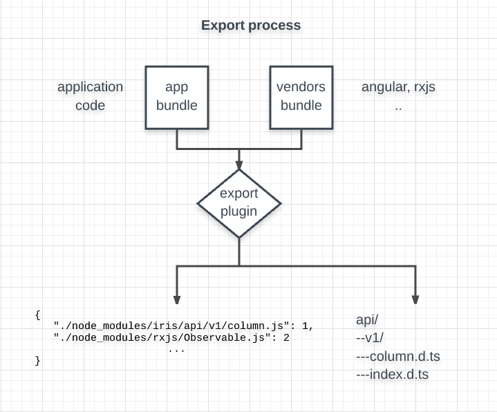
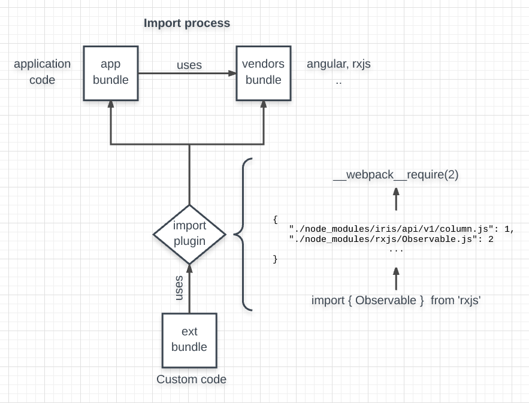

# Extensibility overview

## Goals:

Ability to provide extensibility points for Iris so that developers have the ability to write custom code in frameworks such as Angular or React. 

## Overview
All of the Iris code and its dependencies are distributed with two bundles - app.js(containing Iris code) and vendors.js(containing third party libraries code). Developers have the ability to build a custom bundle (extensions.js) that is used to access code from the above two bundles. This bundle is specific for each Sitefinity and allows for different extensions to be loaded when connecting to different instances of Sitefinity.

We divide the extensibility mechanism into two steps:
export - exporting the Iris API, so it can be consumed from the outside.
import - referencing Iris APIs and third party libraries from outside.

### Export process
We will export three things - the actual API, a special mappings file and an import plug-in.

#### Api
The API that we distribute is in the form of typescript definition files (.d.ts). These files are used to provide compile time checks and documentation. Each major breaking change is distributed in its own version (/v{{version-number}}) folder. Using the .d.ts file to provide the interface for programming, we can change the actual implementation however we find appropriate as long as it complies to the .d.ts file typings. Leveraging this approach, we will minimize breaking changes or handle them gracefully.

#### Mappings file (short version)
There is a special mappings file generated that is used for the import process. The .d.ts files and vendor components files (angular, rxjs) will be referenced in this file. Having the mappings file containing the mappings not only of Iris, but those of its dependencies(vendor components - angular, rxjs) helps provide maximum code reuse. The files, not included in the app & vendors bundle, are included in the extensions bundle.

#### Mappings file (long version)
Webpack holds internally a key-value collection (modules collection) that contains a mapping for each referenced file - ID -> file_contents. Webpack uses this collection internally to manage its "require" calls. In order to access Iris APIs, we need to know of it, so we can require the exact modules we need from outside (accessed from the extensions.js file). Therefore alongside the distribution build, a mappings file is distributed that holds a collection _path_to_file -> ID.

This mappings file is used during the import process to replace all the "require" calls for a specified path to a module with a require with the mapped ID.
e.g. Mappings file:
```javascript
{
	"./node_modules/iris/api/v1/column.js": 1,
	"./node_modules/rxjs/Observable.js": 2
}
```

The user does not need to do any additional work. He will use the "require" method as per the [CommonJs Module specification](http://wiki.commonjs.org/wiki/Modules/1.1).

The above mentioned files (.d.ts & mappings) are distributed via an npm package.



#### Import plug-in
In order for the compilation process to work with the requiring of .d.ts files, we need to plug-in to the webpack compilation mechanism, as these are not actual files (only contracts for those). An Import plug-in is provided for this purpose.

### Import process

#### How will customers write their extensions
1. Customers first install the Iris npm package (holding the above described files). 
2. Then they write some code to be compiled against the distributed .d.ts files (or copy the code from one of our quick-start samples).
3. Compiling their code will produce an extensions.js bundle
4. Copy the bundle to Sitefinity's file system to a specific path



## Debug
#### Compiling the extensions
1. Open a command line and navigate to the root folder of the application (IrisWebApp)
2. Execute "npm run build:prod" to build the main web application
3. Navigate to the /extensions folder
4. Execute "npm i ../dist" to install the iris extensibility package and his dependencies as well
5. Execute "npm i" to install the dependencies of the extensions package
6. Execute "npm i webpack -g" to install webpack globally
7. Execute "npm run build" to build the extensions bundle
8. Copy the newly created file *extensions.bundle.js* from the **wwwroot** folder and paste it into your **SitefinityWebApp**
9. Run the application by [hosting the wwwroot folder in IIS](https://github.com/Sitefinity/Iris/wiki/Host-Iris-in-IIS) (or a web server of your choice that supports history fallback)
