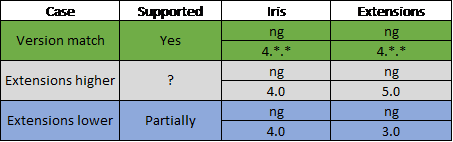

# Extensions

Extensions are a way of hooking up to Iris and its API to be able to plug in custom logic. Examples of such would be:
* Custom action menu command
* Custom columns in the grid
* Replacing an OOB field with a custom one (during edit/create etc..)

The extensions will comprise a **single** JavaScript file(bundle) that will be hosted in Sitefinity. Hosting it there means that a single Iris hosted app can work with many Sitefinity instances.

## API

Iris will expose an API that will allow custom code to be plugged-in. This API will be tested, versioned and backward compatible.

## Versioning issues
As the extensions will be compiled against a version of Angular, there are three cases we need to consider when looking for breaking changes with versioning

### Case 1 – Version match
Version match means that the major version number of the library (SemVer style) will be used when breaking or large changes within a library occur. If this is kept (most popular libraries keep it), we will be able to support any version mismatch between two non-major releases of a library with the same major number. Whenever the third party library introduces a breaking change, we must also issue a new version with a larger major number.

### Case 2 & 3 Version mismatch
This scenario is difficult to support as there may be breaking changes in the code. This means that the clients that have not yet upgraded their library and are still referencing a newer/older major release may risk running into issues.

E.g. of such are 
* file deletion/relocation
* method deletion/rename/signature change.
This has the analogue to the .NET binding redirect issue.

## Implementation

### Option 1 – Bundle Angular with Iris only

As Iris is hosting almost (80% as we are not using the whole Angular yet, but this may change) all of Angular inside of it, we can make available the existing angular code to the public. This would result in a small extensions bundle that does not contain anything except the code for the extensions themselves. 

**Trade-off**

We are exposing the framework to the public and giving them freedom to use the framework. An analogy would be Feather. Feather acts as the Extension to Sitefinity(Iris) and Sitefinity(Iris) provides the .net framework and third party libraries(Angular) with it.

We may limit the customer to a smaller subset of the library. Currently, we are using about 80% of angular, with the exceptions being animations and compiler. However, with the rate we are using we might be reaching 90-100% usage. 

### Option 2 – Bundle Angular with extensions and Iris

Instead of providing the existing run-time and class references, bundle everything in the extensions bundle – framework and other third party libraries. Using this approach we may be able to support a larger spectrum of versions.

**Trade-off**

In the third party libraries there are checks with the "instanceof" operator. Having two classes from two bundles will cause this check to return false and break the logic. An approach here would be to export only the files that have this check, but this may again prove problematic as we do not know which these files are and what the client might be using.

### Option 3 – Wrap everything

Using Option 1 it may be possible to wrap all the angular classes automatically and provide them to the user. Whenever a serious breaking change occurs we can replace the actual class of Angular and try to make it backward compatible.

**Trade-off**

We are unfamiliar with the angular code. Breaking changes are introduced with a purpose and we might not be able to patch it. This may be time consuming and not that much effective.
