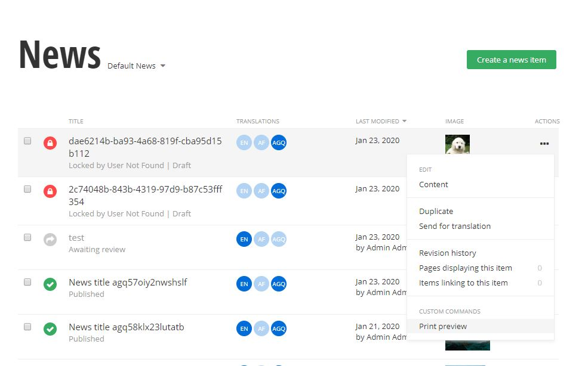

# Custom commands

### Table of content
* [Overview](#overview)
* [Add custom commands](#add-custom-commands)
* [Add custom command categories](#add-custom-command-categories)
* [Remove default commands](#remove-default-commands)
* [Example](#example)

## Overview

> IMPORTANT - Please note that there is a known limitation, you cannot use the Angular binding syntax {{item.data.CreatedBy}}, when creating component HTML templates, you must use another binding, for example [textContent]="item.data.CreatedBy", or [innerHtml]="item.data.Content".

You can register custom command and execute some custom logic when executing them. They can be added in several places:
* in the Grid View 
   * next to the Create command
   * in the settings sidebar (next to the Permissions, Settings, Custom fields, etc. commands)
   * in the grid *Bulk Actions* menu
   * in the *Actions* menu of an item
* in the Edit View
   * next to the Publish button 
   * in the *Actions* menu of an item 


In order to register a custom command, you have to implement the [**CommandProvider**](http://admin-app-extensions-docs.sitefinity.site/interfaces/commandprovider.html) interface. The interface consists of two methods:

* [**getCommands()**](http://admin-app-extensions-docs.sitefinity.site/interfaces/commandprovider.html#getcommands) - returns an **Observable** of [**CommandModel[]**](http://admin-app-extensions-docs.sitefinity.site/interfaces/commandmodel.html). The [**token.type**](http://admin-app-extensions-docs.sitefinity.site/interfaces/tokendata.html#type) property must contain either an **InjectionToken** or a **Type**. Once the Admin App identifies the [**token.type**](http://admin-app-extensions-docs.sitefinity.site/interfaces/tokendata.html#type) property, it dynamically instantiates the [**Command**](http://admin-app-extensions-docs.sitefinity.site/interfaces/command.html) implementation and invokes it with the data provided by the [**properties**](http://admin-app-extensions-docs.sitefinity.site/interfaces/tokendata.html#properties) property.

* [**getCategories()**](http://admin-app-extensions-docs.sitefinity.site/interfaces/commandprovider.html#getcategories) - returns the categories of commands, described above.

```typescript
import { Injectable } from "@angular/core";
import { CommandCategory, CommandModel, CommandProvider, CommandsData } from "@progress/sitefinity-adminapp-sdk/app/api/v1";
import { Observable } from "rxjs";

@Injectable()
class DynamicItemIndexCommandProvider implements CommandProvider {
    getCommands(data: CommandsData): Observable<CommandModel[]> {
        return of([]);        
    }
    
    getCategories(data: CommandsData): Observable<CommandCategory[]> {
        return of([]);
    }
}
```

## Add custom commands

To add a command to the exact place where you want the [**data**](http://admin-app-extensions-docs.sitefinity.site/interfaces/commandsdata.html) property of the [**getCommands()**](http://admin-app-extensions-docs.sitefinity.site/interfaces/commandprovider.html#getcommands) has to be used. Example:

* To add a command to the grid view - the [**dataItem's**](http://admin-app-extensions-docs.sitefinity.site/interfaces/commandsdata.html#dataitem) [**data**](http://admin-app-extensions-docs.sitefinity.site/interfaces/dataitem.html#data) property should be null and the [**target**](http://admin-app-extensions-docs.sitefinity.site/interfaces/commandsdata.html#target) property should have value [**List**](http://admin-app-extensions-docs.sitefinity.site/enums/commandstarget.html#list). **Important:** the command should have a category named 'Default'. Otherwise it will not be visible.

* To add a command to the grid view settings sidebar - the [**dataItem's**](http://admin-app-extensions-docs.sitefinity.site/interfaces/commandsdata.html#dataitem) [**data**](http://admin-app-extensions-docs.sitefinity.site/interfaces/dataitem.html#data) property should be null and the [**target**](http://admin-app-extensions-docs.sitefinity.site/interfaces/commandsdata.html#target) property should have value [**List**](http://admin-app-extensions-docs.sitefinity.site/enums/commandstarget.html#list). **Important:** the command should have a category named 'Settings'. Otherwise it will not be visible.

* To add a command to the grid *Bulk Actions* menu - the [**dataItem's**](http://admin-app-extensions-docs.sitefinity.site/interfaces/commandsdata.html#dataitem) [**data**](http://admin-app-extensions-docs.sitefinity.site/interfaces/dataitem.html#data) property should be null and the [**target**](http://admin-app-extensions-docs.sitefinity.site/interfaces/commandsdata.html#target) property should have value [**Bulk**](http://admin-app-extensions-docs.sitefinity.site/enums/commandstarget.html#bulk).

* To add a command to the grid *Actions* menu of an item - the [**dataItem's**](http://admin-app-extensions-docs.sitefinity.site/interfaces/commandsdata.html#dataitem) [**data**](http://admin-app-extensions-docs.sitefinity.site/interfaces/dataitem.html#data) property should **not** be null and the [**target**](http://admin-app-extensions-docs.sitefinity.site/interfaces/commandsdata.html#target) property should have value [**List**](http://admin-app-extensions-docs.sitefinity.site/enums/commandstarget.html#list).


* To add a command to the edit view *Actions* menu of an item - the [**dataItem's**](http://admin-app-extensions-docs.sitefinity.site/interfaces/commandsdata.html#dataitem) [**data**](http://admin-app-extensions-docs.sitefinity.site/interfaces/dataitem.html#data) property should **not** be null and the [**target**](http://admin-app-extensions-docs.sitefinity.site/interfaces/commandsdata.html#target) property should have value [**Edit**](http://admin-app-extensions-docs.sitefinity.site/enums/commandstarget.html#edit).


* To add a command to the create view *Actions* menu of an item - the [**dataItem's**](http://admin-app-extensions-docs.sitefinity.site/interfaces/commandsdata.html#dataitem) [**data**](http://admin-app-extensions-docs.sitefinity.site/interfaces/dataitem.html#data) property should be null and the [**target**](http://admin-app-extensions-docs.sitefinity.site/interfaces/commandsdata.html#target) property should have value [**Create**](http://admin-app-extensions-docs.sitefinity.site/enums/commandstarget.html#create).

```typescript
    getCommands(data: CommandsData): Observable<CommandModel[]> {
        const commands: CommandModel[] = [];

        if (data.target === CommandsTarget.Create && data.dataItem) {
            const commnad: CommandModel = {
                name: "exampleCommand",
                title: "Example Command",
                category: "Custom",
                ordinal: 1
            }
            
            commnad.token = {
                type: CommandImplementationClass,
                properties: {
                    dataItem: data.dataItem
                }
            };

            commands.push(commnad);
        }
        
        return of(commands);      
    }
```

## Add custom command categories

To add a command category you should implement a model of type [**CommandCategory**](http://admin-app-extensions-docs.sitefinity.site/interfaces/commandcategory.html). The [**name**](http://admin-app-extensions-docs.sitefinity.site/interfaces/commandcategory.html#name) property is used to specify under which category a command should be listed and the [**title**](http://admin-app-extensions-docs.sitefinity.site/interfaces/commandcategory.html#title) property is used for the display name of the custom commands section in the Actions menu. For more information, please see the [screenshot example](#example).

```typescript
const customCommandCategory: CommandCategory = {
    name: "Custom",
    title: "Custom commands"
};
```

## Remove default commands

You can not only add new custom commands but also remove some of the default ones. To achieve this you have to implement the [**CommandsFilter**](http://admin-app-extensions-docs.sitefinity.site/interfaces/commandsfilter.html) interface. The interface consists of a single method:

```typescript
import { Injectable } from "@angular/core";
import { CommandModel, CommandsData, CommandsFilter } from "@progress/sitefinity-adminapp-sdk/app/api/v1";

@Injectable()
class CustomCommandsFilter implements CommandsFilter  {
    filter(operations: CommandModel[], data: CommandsData): CommandModel[] {
        return [];
    }
}
```

* [**filter()**](http://admin-app-extensions-docs.sitefinity.site/interfaces/commandsfilter.html#filter) - the method accepts an array of [**CommandModel[]**](http://admin-app-extensions-docs.sitefinity.site/interfaces/commandmodel.html) that contains all commands and [**data**](http://admin-app-extensions-docs.sitefinity.site/interfaces/commandsdata.html) parameter. Similarly to when adding custom command you have to use the [**data**](http://admin-app-extensions-docs.sitefinity.site/interfaces/commandsdata.html) parameter to determine the place from where you want to remove the command (grid, bulk menu, actions menu, etc.). The method should return the filtered commands.

For example, if you would like to remove the Delete command for the news items you should implement the [**filter()**](http://admin-app-extensions-docs.sitefinity.site/interfaces/commandsfilter.html#filter) method like so:
```typescript
    filter(operations: CommandModel[], data: CommandsData): CommandModel[] {
        if (data.dataItem.metadata.setName === "newsitems") {
            return operations.filter(x => x.name !== "Delete");
        }

        return operations;
    }
```

## Example


