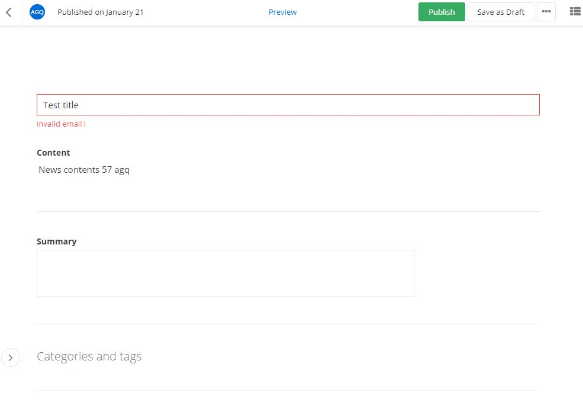

# Custom field

> IMPORTANT - Please note that there is a known limitation, you cannot use the Angular binding syntax {{item.data.CreatedBy}}, when creating component HTML templates, you must use another binding, for example [textContent]="item.data.CreatedBy", or [innerHtml]="item.data.Content".

When in content editing mode, content editors can modify content properties and add content relations via dedicated fields in the UI. For example, **ShortText**, **LongText**, **Number**, **Classifications**, **RelatedData**, and so on. With the Admin App, you can replace one of the default fields when creating and editing items with a custom one. In addition, you can implement a custom visualization for each custom field you create. You do this by providing a custom implementation of the [**FieldsProvider**](http://admin-app-extensions-docs.sitefinity.site/interfaces/fieldsprovider.html) interface. For each field rendered in the UI, the [**overrideField**](http://admin-app-extensions-docs.sitefinity.site/interfaces/fieldsprovider.html#overridefield) method is called. You can also provide a custom field registration for all of the fields or for a specific one.
You also need to provide an implementation of the field for both read and write actions because there may be a case when due to lack of proper permissions or because the item is locked, it cannot be edited.

**NOTE:** Since these components are dynamically instantiated, you need to register them with the **entryComponents** property of the **NgModule**.

**NOTE:** In case there are two custom [**FieldsProvider**](http://admin-app-extensions-docs.sitefinity.site/interfaces/fieldsprovider.html) interfaces that attempt to override the same field, the provider that is first invoked has a priority.

## Example

