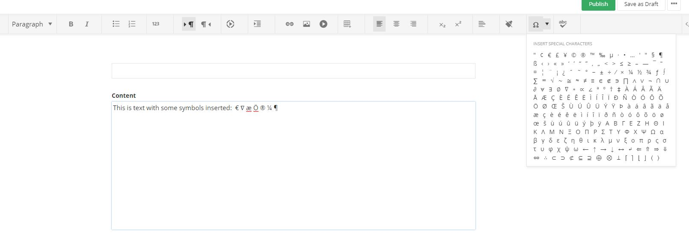

# Insert symbol

## Summary

This is an extension to the rich text editor in **AdminApp** that allows the user to insert a special character picked from a predefined list. The list is replaceable and could be modified to the needs of the user.

## Interactions

The popup with the symbol list dropdown popup is opened via a custom button from the editor's toolbar.

- click: inserts the symbol
- symbol hover: displays a tooltip with the defined name of the symbol

## Symbol list source

The symbols that populate the list are defined in a JSON file that is imported by the extension. The file is generated by a script making use of the [https://dev.w3.org/html5/html-author/charref](https://dev.w3.org/html5/html-author/charref). There are two supplied files for the the symbol list: _symbol-list.json_ and _symbol-list-full.json_. The extension uses by default the _symbol-list.json_ which contains a subset of the fill symbol list.

## Changing the symbol source

Replacing or modifying the required file would change the contents of the insert symbol popup.

## Implementation

**InsertSymbolProvider**: a custom provider that is responsible for registering the tool. The tool itself is responsible for inserting the symbol into the editor.

A **ToolBuilder** class is added in _../utils/tool-builder.ts_ that provides an endpoint for creating and registering a popup tool for the Kendo editor toolbar.

The tool is created and registered in the toolbar and its popup is populated via the **InsertSymbolGenerator** class. Its constructor argument is the JSON file that is used to populate the popup. Making changes to that file, or using another, would change the content of the tool dropdown popup.

Events are attached on InsertSymbolTool._activate() and detached on InsertSymbolTool._close(). On click the _exec() function is called, the symbol is inserted and the popup is closed.

### Added dependencies

No added dependencies	

## Example 

