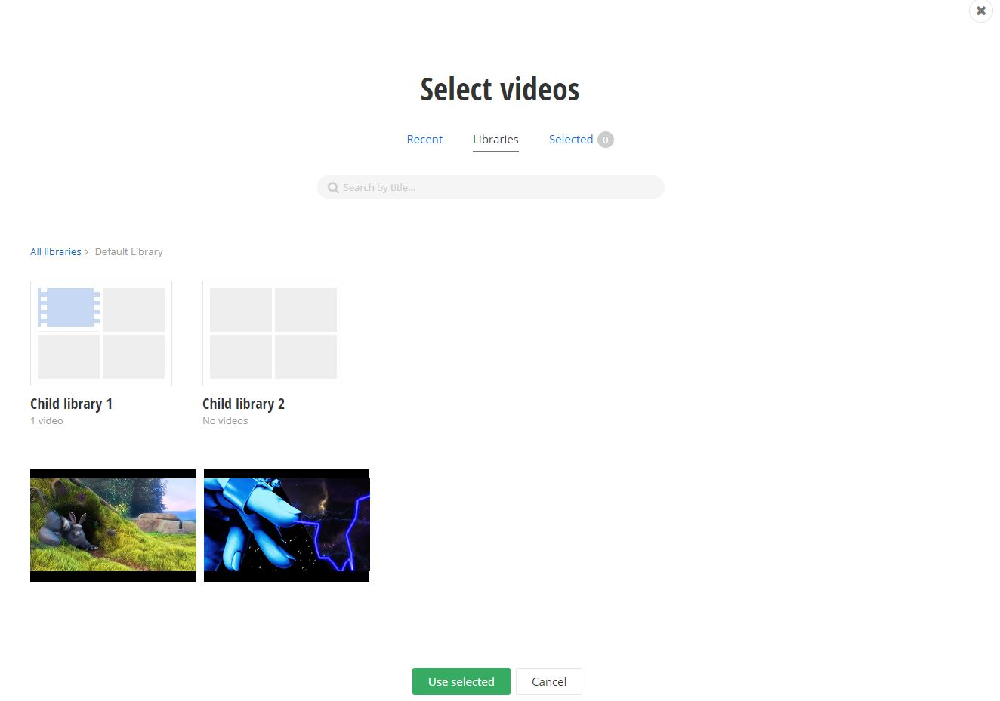

# Insert video

## Summary

This is an extension to the rich text editor in **AdminApp** that allows the user to insert video content from Sitefinity CMS.

## Interactions

This sample adds a custom button to the editor toolbar. Upon pressing the button a video selector dialog is opened. Users can browse the content to find the desired video. After making a selection and closing the dialog the selected video is inserted in the editor.

## Implementation

To extend the editor a custom implementation of the [**EditorConfigProvider**](http://admin-app-extensions-docs.sitefinity.site/interfaces/editorconfigprovider.html) is provided. In order to add the video selector button to the toolbar a custom [**ToolBarItem**](http://admin-app-extensions-docs.sitefinity.site/interfaces/toolbaritem.html) is injected to the configuration by returning it using the [**getToolBarItems**](http://admin-app-extensions-docs.sitefinity.site/interfaces/editorconfigprovider.html#gettoolbaritems) method.

In this example, the built-in [**SelectorService**](http://admin-app-extensions-docs.sitefinity.site/interfaces/selectorservice.html) class is used, which has three methods:

* [**openVideoLibrarySelector**](http://admin-app-extensions-docs.sitefinity.site/interfaces/selectorservice.html#openvideolibraryselector)

Opens a video selector.

* [**openDialog**](http://admin-app-extensions-docs.sitefinity.site/interfaces/selectorservice.html#opendialog)

Opens the custom dialogs.

* [**openImageLibrarySelector**](http://admin-app-extensions-docs.sitefinity.site/interfaces/selectorservice.html#openimagelibraryselector)

Opens an image selector.

## Example

