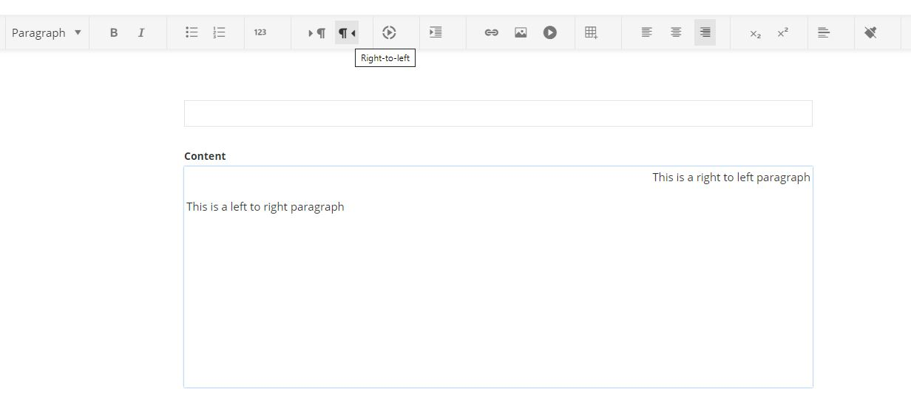

# Switch text direction

## Summary

This is an extension to the rich text editor in **AdminApp** that allows the user to switch text direction for a paragraph. This functionality is useful for languages that use right to left scripts.

## Interactions

This sample adds two custom buttons to the editor toolbar. Pressing the buttons switches the text direction from right to left and vice versa. The functionality is applied per paragraph.

## Implementation

To extend the editor, a custom implementation of [**EditorConfigProvider**](http://admin-app-extensions-docs.sitefinity.site/interfaces/editorconfigprovider.html) is provided. In order to add the switch text direction buttons to the toolbar, a custom [**ToolBarItem**](http://admin-app-extensions-docs.sitefinity.site/interfaces/toolbaritem.html) is injected to the configuration by returning it using the [**getToolBarItems**](http://admin-app-extensions-docs.sitefinity.site/interfaces/editorconfigprovider.html#gettoolbaritems) method.

## Example

