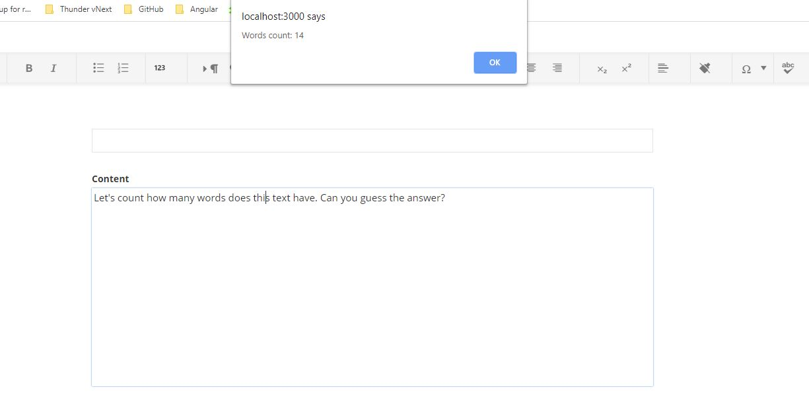

# Custom content editor toolbar with word count

Apart from the major formatting functions, located on the formatting bar in the HTML content editor, you can add a word counter functionality. You do this by providing a custom implementation of the [**EditorConfigProvider**](http://admin-app-extensions-docs.sitefinity.site/interfaces/editorconfigprovider.html). Check the actual implementation in the **word-count-provider.ts** file.

## Example

