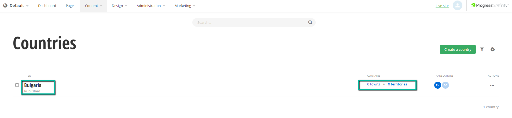

# Reordering the children of a hierarchical type

This configuration concerns the "contains" column of a hierarchical module with two or more child types.



In this example there is parent type called "Countries" which has two child types - "Town" and "Territory", which by default are displayed in this order, and if you click on the parent item, in this example "Bulgaria", the first child type list screen will be opened - the "Towns" list.

To rearrange the child types, find the `config.json` file located in `{{your_project_root}}\SitefinityWebApp\AdminApp`, and in it use the following configuration:

```json
"dynamicModuleChildListOrder": [
    {
        "parentEntitySet": "countries",
        "childEntitySets": ["territories", "towns"]
    }
]
```

After this configuration is applied the "contains" column will now list the types in the order of "territories" and "towns" and when the parent is click it will redirect to the territories list view.

> **Important notes**:
> * As of Sitefinity 13.3.7622.0 the `config.json` file is no longer shipped with the product.
> * The `config.json` file is located in `{{project_root}}/SitefinityWebApp/AdminApp`, if it is missing please create your own file so that you may apply the desired configurations.
