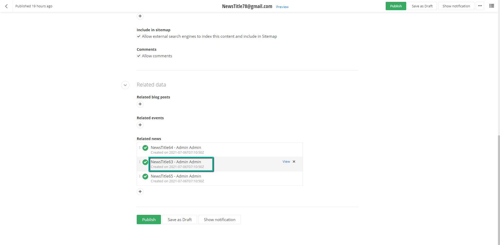
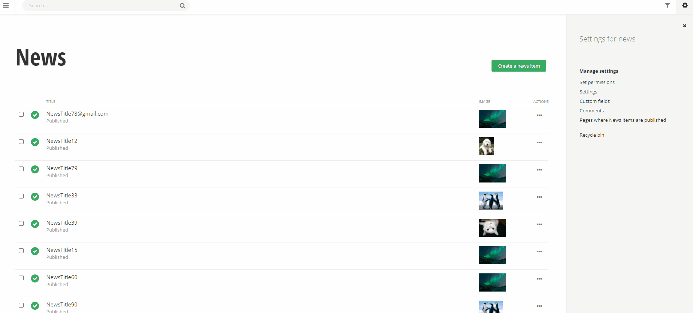

# Custom list components

## Introduction
The list component in the Sitefinity AdminApp is used in various places in the application, for example, the grid (the list of content items), the sidebar, related data and so forth. This extension will allow you to inject a custom Angualr component in the list's item template. The picture below shows where the custom component will be rendered in the list's item template. 



### Demo for related data
The custom component for the related data feature will be rendered, in the following parts of the UI
* already selected related items
* dropdown selector for the recent items and adjacent search feature
* related data selector and adjacent search feature
* readonly mode of the content item



> Please note that the search functionality in the related data fields (and in the entire AdminApp) is based on the item's primary identifier, which in the case of the default content modules is the `Title`. When you modify the component rendered in the tree's item template, it will not affect the search feature. If you would like to add another field to be included in the search, please see the [search config]("./../../search").

## Development process

### Implement the component

Implement a component as you normally would in Angular, with just one requirement, that your custom component **should** extend the `abstract class CustomTreeComponentBase`, it will force you to implement the only property `item: DataItem`, which as stated on top, will be populated by the item that is going to be rendered.

> IMPORTANT - Please note that there is a known limitation, you cannot use the Angular binding syntax {{item.data.CreatedBy}}, when creating component HTML templates, you must use another binding, for example [textContent]="item.data.CreatedBy", or [innerHtml]="item.data.Content".

```typescript
import { Component, Input } from "@angular/core";
import { DataItem } from "@progress/sitefinity-adminapp-sdk/app/api/v1";
import { CustomTreeNodeComponentBase } from "@progress/sitefinity-adminapp-sdk/app/api/v1/tree";

@Component({
    styles: [
        ".bull { font-weight: bolder; }"
    ],
    template: `
    <div>
        <span [textContent]="item.data.Title"></span>
        <span class="bull">&nbsp;&bull;&nbsp;</span>
        <span data-sftest="custom-created-by" [textContent]="item.data.CreatedBy"></span>
    </div>
    <div class="sf-tree__description sf-breadcrumb -sf-overflow-ellipsis">
        <span data-sftest="custom-created-on" [textContent]="item.data.DateCreated | date:'medium'"></span>
    </div>
    `
})
export class RelatedDataCustomComponent extends CustomTreeNodeComponentBase {
    @Input() item: DataItem;
}

```

### Registering the component

The component you have implemented must be registered in a class that implements the `TreeNodeComponentProvider` interface. The interface has a single method `getComponentData` which accepts two parameters, `feature` of type `TreeNodeComponentFeatures`, which currently supports only one feature - the related data, and `entitySet` which is a `string`, intended to represent the currently loaded data. This method will be called by the AdminApp, for example if we assume that your project's news items, have a related data field for events, the values passed in the method will `TreeNodeComponentFeatures.RelatedData` and `events`, therefore your implementation of the provider should return a `ComponentData` object that you would like to be used when displaying the related data nodes in the content item.

To implement a custom provider you start of by creating a custom class, which for the sake of the sample will be called `RelatedDataTreeNodeComponentProvider` and it must implement the `TreeNodeComponentProvider` interface.

```typescript
import { TreeNodeComponentProvider, ComponentData } from "@progress/sitefinity-adminapp-sdk/app/api/v1";
import { TreeNodeComponentFeatures } from "@progress/sitefinity-adminapp-sdk/app/api/v1/tree/custom-tree-node-component-features";

export class RelatedDataTreeNodeComponentProvider implements TreeNodeComponentProvider {

    getComponentData(feature: TreeNodeComponentFeatures, entitySet: string): ComponentData {
    }
}

```

Sample implementation:

```typescript
import { TreeNodeComponentProvider, ComponentData } from "@progress/sitefinity-adminapp-sdk/app/api/v1";
import { TreeNodeComponentFeatures } from "@progress/sitefinity-adminapp-sdk/app/api/v1/tree/custom-tree-node-component-features";
import { RelatedDataCustomComponent } from "./related-data-custom.component";

export class RelatedDataTreeNodeComponentProvider implements TreeNodeComponentProvider {
    getComponentData(feature: TreeNodeComponentFeatures, entitySet: string): ComponentData {
        if (feature === TreeNodeComponentFeatures.RelatedData && entitySet === "newsitems") {
            const componentData: ComponentData = {
                type: RelatedDataCustomComponent
            };

            return componentData;
        }

        return null;
    }
}
```

Almost there, we need to export the provider using a special Angualr DI token `CUSTOM_TREE_COMPONENT_TOKEN`.

```typescript
import { ClassProvider } from "@angular/core";
import { ComponentData } from "@progress/sitefinity-adminapp-sdk/app/api/v1/index-component/component-data";
import { TreeNodeComponentProvider , CUSTOM_TREE_COMPONENT_TOKEN } from "@progress/sitefinity-adminapp-sdk/app/api/v1/tree";
import { TreeNodeComponentFeatures } from "@progress/sitefinity-adminapp-sdk/app/api/v1/tree/custom-tree-node-component-features";
import { RelatedDataCustomComponent } from "./related-data-custom.component";

export class RelatedDataTreeNodeComponentProvider implements TreeNodeComponentProvider {
    getComponentData(feature: TreeNodeComponentFeatures, entitySet: string): ComponentData {
        if (feature === TreeNodeComponentFeatures.RelatedData && entitySet === "newsitems") {
            const componentData: ComponentData = {
                type: RelatedDataCustomComponent
            };

            return componentData;
        }

        return null;
    }
}

export const CUSTOM_TREE_COMPONENT_PROVIDER: ClassProvider = {
    useClass: RelatedDataTreeNodeComponentProvider,
    multi: true,
    provide: CUSTOM_TREE_COMPONENT_TOKEN
};

```

Last but not least, we must create a custom angular module for this extension (you could reuse another module if you have created one previously) and register it where all other extension are registered.

Custom module: 

```typescript
import { CommonModule, DatePipe } from "@angular/common";
import { NgModule } from "@angular/core";
import { CUSTOM_TREE_COMPONENT_PROVIDER } from "./related-data-custom-tree-node-component-provider";
import { RelatedDataCustomComponent } from "./related-data-custom.component";

@NgModule({
    declarations: [
        RelatedDataCustomComponent
    ],
    entryComponents: [
        RelatedDataCustomComponent
    ],
    providers: [
        CUSTOM_TREE_COMPONENT_PROVIDER,
        DatePipe
    ],
    imports: [
        CommonModule
    ]
})
export class RelatedDateExtenderModule { /* empty */ }

```

To register the module, go to the `__extensions_index.ts` file and add the following line:

```typescript
sitefinityExtensionsStore.addExtensionModule(RelatedDateExtenderModule);
```

Your `__extensions_index.ts` file should look something like this:

```typescript
import { SitefinityExtensionStore } from "@progress/sitefinity-adminapp-sdk/app/api/v1";
import { RelatedDateExtenderModule } from "./tree/related-data";

declare var sitefinityExtensionsStore: SitefinityExtensionStore;

sitefinityExtensionsStore.addExtensionModule(RelatedDateExtenderModule);
```

> If you think that we should improve this extension, or for that matter anything in the Sitefinity product, please submit an enhancement request, for more information on how to do so, please see this [knowledge base article](https://knowledgebase.progress.com/articles/Knowledge/P11255). We also welcome issues in this github repo.