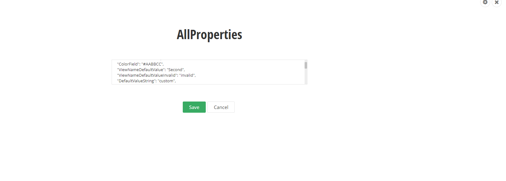

# Admin App custom widget editor

> IMPORTANT - Please note that there is a known limitation, you cannot use the Angular binding syntax {{item.data.CreatedBy}}, when creating component HTML templates, you must use another binding, for example [textContent]="item.data.CreatedBy", or [innerHtml]="item.data.Content".

With this AdminApp extensibility point, you can create your own custom widget designers and override the default auto generated designers.

In this example we have provided two samples:

* For overriding a specific field for a widget designer.

* For overriding the entire view for a widget designer.

## Overriding a custom field

The process is exactly the same as it is with overriding a field for a content type with the exception that the typeName of the item is equal to widget-{WIDGET_NAME}.

The process involves registering a custom field provider class by inheriting from the [FieldsProvider provider interface](http://admin-app-extensions-docs.sitefinity.site/interfaces/fieldsprovider.html) and implementing the method ["overrideField"](http://admin-app-extensions-docs.sitefinity.site/interfaces/fieldsprovider.html#overridefield). This method is called for each and every field when it is being rendered in the interface. Thus you are able to replace each field. 

 The parameter that is passed to the method contains three properties:

* fieldType -> The type of the field(shorttext, longtext, for all available field types see the FieldTypes class)
* fieldName -> Holds the name of the field (Title, Content, Description)
* typeName -> Holds the type, whose fields are currently being rendered.

When a widget designer is opened, the typeName property will have the value of widget-{WIDGET_NAME}, where WIDGET_NAME is the name of the widget and you can choose to override the fields for each widget selectevely.

For reference please refer to the [custom fields sample](../custom-fields/README.md) and the file "widget-editor-custom-fields-provider".

## Overriding the entire designer

If you wish to replace the appearance of the entire designer, then you can do so by inheriting from the WidgetEditorViewProvider interface. This interface gets called each time a widget designer is opened. It contains a [single method]((http://admin-app-extensions-docs.sitefinity.site/interfaces/custom-widget-editor-view-provider.html#overrideView) which gets invoked by the AdminApp. This method gets invoked with a single parameter(context) that has the property widgetName. The name of the currently edited widget is passed as a value in this parameter. Thus you can selectively decide whether to override the designer for a specific widget or not. For reference see the [CustomWidgetEditorViewProvider](http://admin-app-extensions-docs.sitefinity.site/interfaces/custom-widget-editor-view-provider.html) class.

As a return result from this method, it is required to return the reference to the component that you wish to be displayed. This component must implement the interface WidgetEditor. It contains the following methods:

* initialize -> invoked when the custom editor is instantiated for any kind of initialization logic. As a parameter we pass all the widget and property metadata that can be used for generating the UI.

* setValues -> invoked when the property values for the designer are retrieved from the server and here they are passed as a parameter in order to set them to the fields.

* validate -> invoked when save is performed. Here we require to validate the designer and if there are errors present return them as a return paremeter.

* actionExecuting -> invoked when an action is executed (save) so you can plug-in your own custom logic.

* getModifiedProperties -> invoked to return the modified properties from the designer.

For reference, refer to the [custom-wdiget-editor.component](http://admin-app-extensions-docs.sitefinity.site/interfaces/custom-editor/custom-wdiget-editor.component)

## Example

